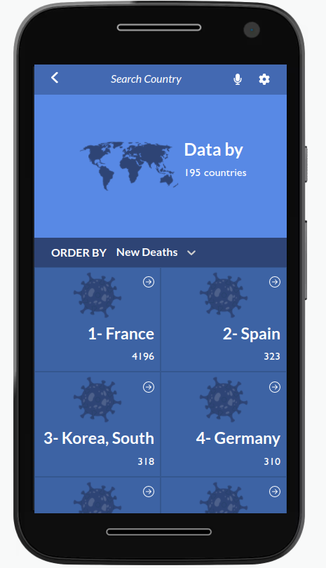
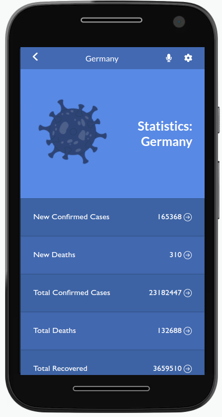

# React Capstone Project - COVID-19 DATA

> This capstone project is a Covid-19 tracker which displays the most recent COVID-19 statistics around the globe from the [Narrativa API](https://covid19tracking.narrativa.com/index_en.html). It is also a mobile-first application built with React, Redux, JavaScript, Bootstrap, API

Homepage
 

Details Page
 

## Built With

- JavaScript
- React
- Redux
- React Bootsrap

## Live Demo
[Live Demo - Netlify](https://covid-data-1304.netlify.app/)

## Getting Started

To get a local copy follow these simple example steps.  

1. Open the terminal window and clone the repository using this command:  
`git@github.com:leopiresgoss/react-capstone-project.git` 

2. Change the directory to the react-bookstore directory  
`cd react-capstone-project`  
3. Install the project's dependencies by running this command:   
`npm install`   
4. Run this command to see the page `npm start`  
5. To see the code open the project in the code editor of your preference.

 

>OBS.: The data is from the [Narrativa API](https://covid19tracking.narrativa.com/index_en.html). For more information, please check its documentation.

 

## Author
👤 **Leonardo Pires Goss**
- GitHub: [@leopiresgoss](https://github.com/leopiresgoss)
- Twitter: [@leonardopgoss](https://twitter.com/leonardopgoss)
- Linkedin: [@leonardogoss](https://www.linkedin.com/in/leonardogoss/)

## 🤝 Contributing

Contributions, issues, and feature requests are welcome!

Feel free to check the [issues page](https://github.com/leopiresgoss/react-capstone-project/issues).

## Show your support

Give a ⭐️ if you like this project!

## Acknowledgments

- A special thank for @fernandorpm for this amazing [README template](https://github.com/microverseinc/readme-template)
- The project's design was inspired by the <a href="https://www.behance.net/gallery/31579789/Ballhead-App-(Free-PSDs">Ballhead-App</a>. My sincere thanks to [Nelson Sakwa](https://www.behance.net/sakwadesignstudio) for for sharing this incredible design with us.

## 📝 License

This project is [MIT](LICENSE) licensed.
